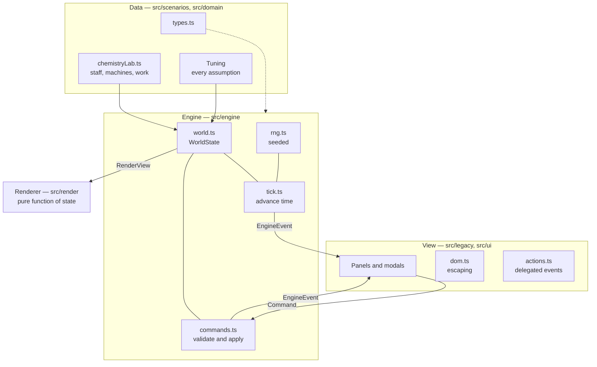

# Polaris

**See what a decision does before you pay for it.**

A lab manager is weighing four options: hire a technician, lease a second mass
spectrometer, add an evening shift, or cross-train two people. Each costs real
money, and the honest answer to "which one helps?" is usually a spreadsheet and
a guess. Polaris simulates the lab instead — people, machines, work, deadlines —
and shows what each decision would actually do.

The product principle is that it has to be legible to the person making the
decision. She is not an engineer; she thinks in shekels, deadlines and people.
So the output is a plain-language verdict and a picture of her lab, not a table.

> **Status: Phase 1 complete.** The application has been restructured from a
> single 75 kB HTML file into a tested, typed codebase with the simulation
> separated from the screen. The "what if?" comparison itself is Phase 4 — see
> [Roadmap](#roadmap). What runs today is the live lab: a working simulation you
> can operate by hand.

**[Try the demo →](https://bellatryx-monorepo.vercel.app/lab-simulation.html)**

---

## Credits

Polaris began as a joint project with a friend, developed in the
**Bellatryx-Runi** organisation, where the original landing page and the first
version of the simulation were built together. This repository continues that
work.

The lab scenario was shaped with a working chemistry lab manager, whose problems
decided what the model needed to represent: a single instrument that everything
queues behind, rush orders that cost the most when missed, and one senior person
quietly carrying the week.

---

## Running it

```bash
npm install
npm run dev          # http://localhost:5173/lab-simulation.html
```

| Command | What it does |
|---|---|
| `npm run dev` | Vite dev server with hot reload |
| `npm run build` | Typecheck, then build to `dist/` |
| `npm run preview` | Serve the built output |
| `npm test` | Run the test suite once |
| `npm run test:watch` | Re-run tests on change |
| `npm run typecheck` | `tsc --noEmit` |
| `npm run lint` | ESLint, including the legacy-directory check |
| `npm run format` | Prettier |

**A run is reproducible.** Open the simulation with `?seed=42` and it replays
exactly: same staff, same events, same outcome. Without the parameter the seed
comes from the clock, and is logged to the console so any interesting run can be
replayed.

---

## How it fits together



**The engine knows nothing about the screen.** It takes a world and a slice of
time and returns a list of things that happened. The view turns clicks into
commands and events into sentences. Nothing crosses that line in either
direction.

This is enforced rather than agreed: ESLint rejects `Math.random`, `Date.now`,
`window` and `document` anywhere under `src/engine`, each with a message saying
why. The separation of concerns is a lint error, not a convention.

```
src/
  domain/      shared types — depends on nothing
  engine/      the simulation: headless, deterministic, tested
  scenarios/   the chemistry lab's data and every tunable assumption
  render/      canvas drawing — a pure function of a view
  ui/          safe HTML construction, event delegation
  legacy/      the view layer, not yet split into modules
```

---

## Technical decisions

**The engine mutates its world rather than returning a new one.** Phase 4 runs
hundreds of simulated weeks; a fresh `WorldState` per step would mean tens of
millions of allocations. Determinism does not require immutability — it requires
that output depends only on the inputs, which the banned globals above
guarantee.

**Randomness is seeded.** Comparing "hire someone" against "do nothing" is only
fair if both face the same sequence of events. Unseeded randomness measures
luck. It also made the rules untestable, because you could never set up the same
situation twice.

**Rendering escapes by default, and the type system enforces it.** `html`
returns a branded type that the DOM-writing function is the only consumer of, so
an unescaped string cannot reach `innerHTML` by accident. A framework would give
the same guarantee, but migrating to one mid-refactor would have meant rewriting
every template in a change whose whole premise was that nothing visible moved.

**Events carry facts, not sentences.** The engine reports
`{ type: 'task-completed', staffName, reward }`; the view decides that reads
"Task completed by Dana Cohen. +$500" and that it is green. That is what lets
the simulation run with nothing attached, and it makes later features consumers
of the event stream rather than new branches inside the rules.

---

## Model assumptions and limitations

Every tunable number lives in one `Tuning` object in
[`src/scenarios/chemistryLab.ts`](src/scenarios/chemistryLab.ts) — starting
budget, training cost and duration, repair and calibration, wear rates, event
rates. They are collected deliberately: Phase 4 surfaces them as an editable
panel, because a verdict is only trustworthy if you can see and change what it
assumed.

Known limitations, stated rather than hidden:

- **"Energy %" is invented.** It drains, refills and sends people on breaks, but
  it is not grounded in anything measurable. Phase 2 replaces it with hours
  worked, overtime and a fatigue effect on task duration and error rate.
- **An operator and a machine are locked together.** A task step occupies both
  for one duration, so the model cannot yet express "the sample is in the
  instrument for 90 minutes while the operator does something else". Phase 2
  makes work items first-class, which is what that needs.
- **Work does not arrive; it is assigned by hand.** There is no queue, no
  backlog and no deadline pressure from demand. Phase 2 adds arrivals.
- **Time units are inconsistent.** A step's duration counts down in simulated
  seconds but is labelled "min" in the task modal. Phase 1 preserved the
  behaviour deliberately rather than changing how the game feels without tests
  to catch it; Phase 2 fixes it alongside the assumptions work.
- **One scenario.** The engine is being made domain-agnostic, but the product
  ships one polished lab rather than a build-your-own-business tool.

---

## Roadmap

| Phase | |
|---|---|
| **1 — Structure** | ✅ Vite + TypeScript, engine separated from rendering, seeded and tested, XSS closed |
| **2 — Engine** | Domain-agnostic model, work items as first-class entities, real metrics replacing energy, CI |
| **2.5 — Redesign** | Clarity, not decoration: a goal on first load, plain language, a short walkthrough, ending in a usability test with someone who has never seen it |
| **3 — Backend** | TypeScript serverless API, Postgres, validation, migrations |
| **4 — "What if?"** | Two labs side by side, a few hundred seeded runs per option, one plain-language verdict with a range |
| **5 — Polish** | Accessibility, responsive layout, screenshots |

### Next steps, beyond the roadmap

- **An AI advisor** turning a free-text question into scenarios, running them and
  explaining the result.
- **Calibration** — replay a real past month and compare the simulation against
  what actually happened. The honest test of whether any of this is believable.
- **Comparing assignment strategies**, greedy against optimal.
- **A second domain** — an emergency room or a dispatch centre — to show the
  engine really is generic.

---

## Notes on the work

[`docs/interview-notes.md`](docs/interview-notes.md) records each step of the
refactor: what changed, why, and what went wrong. Among other things it covers a
bug where the simulation ran 2.4× faster on a 144 Hz monitor, a `NaN` that
silently stopped drawing anything, and a stored-XSS hole that is now pinned shut
by a test.
